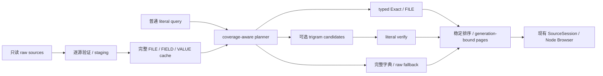

# Phase 2 Search：架构与全库索引调查

日期：2026-10-04。状态：**INVESTIGATION / AWAITING REVIEW**。本文是调查证据与候选建议，不是 accepted architecture，也不授权 production Search。

范围依据外层 `prompt/Phase 2 Search/RefAtlas Phase 2 Search — Architecture & Full-Dataset Index Investigation Prompt.md`。已阅读 PROJECT、ARCHITECTURE、ROADMAP、STATUS、PERFORMANCE、ADR-0002/0004/0007–0010、Phase 2A 调查与评审、Raw Foundation、Slice E Windows 与 Mac 报告。既有无损、地址、生命周期、完整性和 localization 原则继续有效。

## 1. 结论与证据边界

完整 occurrence 索引在本机可行，但它是数千万行、十余 GiB 的持久缓存，不能当成附属于浏览请求的小型内存索引。推荐继续评审 C 家族：独立 files、完整 Pointer、带类型的内容字典与 occurrence 表。完整基线与原始来源 reference truth 的差分见后文；加速覆盖与事实覆盖必须分开。

**当前整个 workspace 不能宣称 complete。** 137,916 个来源全部进入普查，其中 15 个存在重复 object key；它们的 19,702 个 FIELD/VALUE occurrence 可统计，却无法在当前唯一 Pointer 契约下发布可导航结果。137,901 个可导航来源共有 83,513,357 行，逐 occurrence 对照独立 parser 后一致。FILE 搜索仍覆盖全部 137,916 个来源。

另有明确的 production 前置缺陷：现有 tokenizer 的分段 TextDecoder 会吞掉 U+FEFF。真实 `TextMap/TextMapJP.json` 的 `/7505878640962067595` 首字符因此丢失。调查修正了自身观察层与一行 B 索引，重新执行完整独立校验，再构建 A/C；**生产 adapter 未修改**。不能把这次修正后的实验索引当成当前生产 parser 已无损的证明。

<!-- decision-measurements:start -->
字典优先 C 的 string Contains `Avatar` 重复均值 1946.55 ms；A/B/naive C 分别 27008.32 / 9324.93 / 1880.02 ms。初始 C 的 string 查询已采用 SCAN dictionary + facts_dict，但 VALUE 零结果查询为 20435.43 ms，强制顺序字典扫描后为 1770.58 ms；schema 本身不足以保证快查询，planner 必须验证实际访问顺序。

推荐 V1 默认完整 C literal 路径，**不默认启用 trigram**：全量 scalar trigram 原生崩溃，不能视为完整成功候选。已完成的 literal 与成功 accelerator 集合差分见第9节；unicode61/LIKE 的不一致和失败 accelerator 均保留。
<!-- decision-measurements:end -->

## 2. 环境、来源与方法

应用 HEAD：`8e82ffc6339399d55b20d537f47d35a8f609ebb4`；外部 HEAD：`724b139d8c9c32d12552eb95745a4fee72bfe48b`。开始时两者工作树干净。外部数据只读，数据库、fixtures、日志、Electron profile 均放在被忽略的 `tools/investigation/artifacts/search/`，没有写到来源旁。

Windows x64 / 10.0.26300 / Intel i9-14900HX / 32 logical CPUs / 33,970,466,816 bytes RAM；Node 24.21.0、better-sqlite3 13.0.3、SQLite 3.53.4、FTS5。独立 reference parser 为已安装的 stream-json 3.7.0。无依赖或 lockfile 变化，无公网查询、安装或下载。Python 3.13.5 仅提供 Unicode 15.1 casefold 映射；NFC 使用 Node Unicode 17.0，版本差异已记录。

三个 base schema 各完整物化一次，候选串行；索引重建补测和 accelerator 对照另行记录。每个查询做三次 SQL count：同一连接首次观察与两次重复运行；集合验证另行计时之外执行。**未清空 OS cache，任何“首次”均不是冷读。** 计数 SQL 用于诊断，不能当成可取消 planner、IPC 或 UI latency。

观察层复用成熟 Tokenizer/TokenParser、数字 lexeme override、UTF-8 fatal 验证、文件 BOM 基准、Pointer escaping 和重复键拒绝规则；原始 quoted string token 经原生 JSON.parse 解码，只处理单个受预算约束的字符串，绝不解析 whole source 或把 number 转 JS Number。FIELD 在关联 value 分配地址时输出，包括容器成员；key 本身不建立 Node。

调查预算是 64 KiB 读取块、16 MiB token、depth 256、每来源 120 秒、RSS 2 GiB；每读取块让出 event loop。生产预算仍为 4 KiB 块、256 KiB token、128 MiB source、8M tokens、depth 128、15 秒和既有地址/响应限制。这些是两套预算；预览、segment、生产资源拒绝不会变成完整搜索事实。

独立 stream-json 再扫描全部原始 JSON，保留数字词法，并按来源、class、type、完整 Pointer、完整内容、occurrence 顺序逐项对照 B。冻结 24 个查询，将满足条件的 occurrence ID 写入独立 truth 库，最终查询逐 ID 集合归并计算 false negative/positive。A/C 是全量 B 的确定性 schema 转换，未抽样、未外推；其读取/解析阶段复用 B，**没有测 direct-from-raw C 构建**。FILE 三库完整清单与独立来源清单一致，两个文件查询按身份集合对照。

在 trigram-all 崩溃恢复后，额外逐行 SQL 对照 A/C 与 B 的全部83,513,357行，包含完整 Pointer、class/type/content、source order、byte range及 path/revision：A65.0秒、C91.3秒，均零差异。不是只核对行数或24个命中集合。

最后一次 FTS 失败后，再完整对照 C 与 B 全部83,513,357行，耗时87.80秒，仍为零差异；失败 accelerator 不影响这项已保留的基础事实完整性证据。

## 3. 全库事实普查

原始 JSON 总量：**137,916 文件，2,617,263,428 bytes（2.438 GiB）**。普查包括所有失败地址来源的 raw occurrence；可查询索引另列，避免把错误前缀统计当完整数据。

| Fact / raw type | 全部 raw occurrence | 可导航索引 occurrence |
| --- | ---: | ---: |
| FILE | 137,916 | 137,916 |
| FIELD | 46,203,791 | 46,191,998 |
| VALUE string | 15,411,037 | 15,407,606 |
| VALUE number | 20,308,946 | 20,304,471 |
| VALUE boolean | 1,597,024 | 1,597,021 |
| VALUE null | 12,261 | 12,261 |
| FIELD + VALUE | 83,533,059 | 83,513,357 |

共有 37,329,268 个 raw scalar；加 FILE 后 searchable facts 为 83,670,975。完整 raw distinct FIELD 为 **595,782**；额外扫描 15 个歧义来源，没有增加 distinct field。可导航类型字典有 8,827,401 项：FIELD 595,782、string 5,410,617、number 2,820,999、boolean 2、null 1。scalar distinct 数字只针对可导航范围。

补充普查15个歧义来源的distinct scalar：另有1,490个string、7个number lexeme；完整raw distinct string=5,412,107、number=2,821,006，boolean/null不增加。它们用于全库统计，不发布歧义地址。“可导航索引”在本文指唯一physical address；并不表示已逐个证明现有Browser能在其独立资源预算内读取全部节点。

长度单位为 code point，孤立 surrogate 单独保留为一个字面单元；不是 UTF-16 length 或 UTF-8 bytes。

| 内容 | p50 | p95 | p99 | max |
| --- | ---: | ---: | ---: | ---: |
| FIELD | 9 | 20 | 30 | 148 |
| string | 26 | 152 | 304 | 20,687 |
| numeric lexeme | 5 | 11 | 20 | 20 |
| relative path | 68 | 100 | 125 | 162 |

最长 scalar 是 `TextMap/TextMapDE.json` `/11982375912687773937`，20,687 code points / 21,099 UTF-8 bytes，明显超过一次 4,096 显示段。最深 searchable Pointer depth 31，位于 `Config/ConfigAbility/Avatar/Avatar_Qingque_00_Ability.json`；完整 Pointer 保留在证据。

全部成功来源的最大 Pointer UTF-8 长度301 bytes，位于 `Config/ConfigAbility/Monster/Monster_W1_Mecha04_00_Ability_RL.json`，没有观察到超过现有4 KiB地址预算的 Pointer。这里证明的是地址表示与语义，未逐个调用生产 Browser 导航全部83M occurrence；生产浏览资源预算仍是独立边界。

代表性高重复事实的全库raw频率：FIELD `$type` 2,503,580次、`Value` 1,750,130次、`ID` 962,294次；number `1` 1,950,709次，boolean `true` 1,134,380次。可导航范围对应`Value` 1,747,207、number `1` 1,950,467、true 1,134,378；证据保留原top选择与15歧义来源的频率补充，不将该补充冒充重新排序的全库top列表。短查询与常见Exact都可能产生百万结果，完整匹配与一次返回全部结果是不同要求。

ID-like 仅按明确外观规则计数：无符号、首位非零、4–20 ASCII decimal digits。number 4,697,137 次、string 24,556 次；不包含 FIELD，不解释为实体、ID、reference 或关系。number 中 negative-zero 外观 27 次、含小数点 6,387,259 次、含 exponent 68,390 次，统计可重叠。

## 4. Container 与 TextMap

不推荐把 object/array serialization 作为 V1 独立 searchable text。全库 18,964,248 个容器的无空白、保留 numeric lexeme、顺序及重复键的 serialization 合计 **5,224,809,064 bytes**；这是容器文本附加量，不含索引 overhead，也不是原始文件大小。

`拍` 在 scalar serialization 中匹配 5,531 次，祖先容器再产生 53 次；`1001` scalar 匹配 187,690 次，容器再产生 266,220 次，合计约 2.418 倍 scalar 命中。容器文本还包含字段名，此例不是只衡量 VALUE 相同文本的严格倍率。容器可能加入嵌套来源包装和祖先重复，无法给用户清晰的独立 occurrence。FIELD 仍包含值为容器的成员，所以排除容器内容不丢 field 搜索。

TextMap 按实际来源逐文件统计；没有硬编码“TextMap 专属”查询路径。完整语言/分片贡献见证据 `textMap`，如下表。逻辑 payload 列是文本列 UTF-8 字节合计，不是物理 SQLite 页归属。

<!-- textmap:start -->
| 来源 | raw bytes | FIELD+VALUE | parse+insert wall ms | B 逻辑 payload bytes |
| --- | ---: | ---: | ---: | ---: |
| TextMapCHS.json | 52,399,646 | 948,386 | 4629.02 | 117,270,917 |
| TextMapCHT.json | 52,579,992 | 948,396 | 4566.49 | 117,682,008 |
| TextMapDE.json | 65,927,157 | 948,390 | 5108.42 | 144,353,474 |
| TextMapEN.json | 59,061,007 | 948,394 | 4537.18 | 130,621,553 |
| TextMapES.json | 62,520,864 | 948,390 | 5118.04 | 137,573,766 |
| TextMapFR.json | 67,261,153 | 948,388 | 5432.91 | 144,905,080 |
| TextMapID.json | 62,088,503 | 948,396 | 4590.06 | 136,588,664 |
| TextMapJP.json | 69,174,020 | 948,396 | 5037.89 | 150,837,778 |
| TextMapKR_0.json | 41,105,670 | 474,188 | 3506.12 | 71,828,978 |
| TextMapKR_1.json | 43,948,077 | 474,190 | 3732.60 | 76,582,216 |
| TextMapMainCHS.json | 74,529 | 2,318 | 10.40 | 179,798 |
| TextMapMainCHT.json | 74,631 | 2,318 | 10.57 | 180,018 |
| TextMapMainDE.json | 89,702 | 2,318 | 10.80 | 210,296 |
| TextMapMainEN.json | 80,645 | 2,318 | 9.79 | 192,246 |
| TextMapMainES.json | 89,675 | 2,318 | 10.42 | 210,296 |
| TextMapMainFR.json | 91,309 | 2,318 | 10.88 | 213,230 |
| TextMapMainID.json | 82,755 | 2,318 | 10.65 | 196,456 |
| TextMapMainJP.json | 95,651 | 2,318 | 10.74 | 222,042 |
| TextMapMainKR.json | 105,332 | 2,318 | 12.86 | 213,362 |
| TextMapMainPT.json | 87,160 | 2,318 | 10.56 | 205,274 |
| TextMapMainRU.json | 114,219 | 2,318 | 12.16 | 259,394 |
| TextMapMainTH.json | 145,816 | 2,318 | 12.58 | 322,580 |
| TextMapMainVI.json | 92,761 | 2,318 | 11.34 | 216,476 |
| TextMapPT.json | 63,050,179 | 948,392 | 5117.36 | 138,585,630 |
| TextMapRU_0.json | 43,164,047 | 474,188 | 3004.20 | 92,639,645 |
| TextMapRU_1.json | 45,894,163 | 474,190 | 3359.32 | 98,089,125 |
| TextMapTH_0.json | 59,888,997 | 474,196 | 3367.68 | 125,999,951 |
| TextMapTH_1.json | 62,809,394 | 474,196 | 3466.49 | 131,805,441 |
| TextMapVI.json | 73,607,269 | 948,392 | 8523.39 | 159,663,208 |

B 逻辑载荷=text + exact_key + pointer_key 的 UTF-8 bytes，全语言/分片已测，排除 row/index/page overhead；C 的共享字典与物理页不能按该数字直接分摊。
<!-- textmap:end -->

最大来源文件 `TextMapVI.json` 为 73,607,269 bytes；最多 occurrence 的单源则是 `ExcelOutput/SpecialAvatarRelicMainValue.json`：2,125,200 行，53,642,663 source bytes。TalkSentenceConfig 为 1,914,689 行。不能因 TextMap 文本大而忽略其他结构来源，或给 TextMap filename 特殊 correctness 规则。

## 5. V1 literal 语义建议

| 范围 | Exact | Contains | 导航 |
| --- | --- | --- | --- |
| FILE | filename 或完整 relative path 相等 | filename/path 的连续字面子串 | source root |
| FIELD | decoded field name 相等 | decoded name 的连续字面子串 | associated value NodeAddress |
| VALUE number | numeric lexeme 相等 | lexeme 连续子串 | scalar NodeAddress |
| VALUE string | decoded string 相等 | decoded string 连续子串 | scalar NodeAddress |
| VALUE boolean / null | `true` / `false` / `null` 字面相等 | 同一 literal 文本的连续子串 | scalar NodeAddress |

推荐默认 case-sensitive、无 Unicode normalization、无数值归一化。`1`、`1.0`、`1.00`、`1e0`、`-0` distinct；大整数不 CAST、parseFloat 或 Number。string `"1001"` 与 number `1001` 共享输入查询，但结果保留 raw type，不相互转换。`true`、`null` 是普通 literal：VALUE 全类型查询同时检索对应原生类型与同文本 string，用户不写 SQL、FTS 语法或类型表达式。

decoded string Exact 不比较 JSON escape spelling；`"\u0061"` 与 `"a"` 解码后相等，但显示出处仍能回到 raw range。Contains 使用连续 code-point 边界；emoji 不拆成半个合法 surrogate pair。NUL、孤立 surrogate 和 combining marks 不丢失、不替换、不隐式 NFC。多字节 UTF-8 与跨读取块的 escape/子串必须能匹配。空输入不发起搜索；显式范围或类型筛选为未来 UI 选项，不发明 query language。

真实跨类型 Exact：VALUE `1001` 4,065 次，其中 string23、number4,042；`true` 1,134,406 次，其中 boolean1,134,378、string28；`null` 12,386 次，其中 null12,261、string125。共享输入字面量没有丢弃类型区分。

真实全库大小写差异：FIELD ASCII case-insensitive 折叠会合并 125 组 / 255 distinct 名称，string 3,149 组 / 6,348 distinct 内容；Unicode full casefold 为 string 3,384 组 / 6,820 内容。例如 `RoleID`/`RoleId`/`Roleid`、`FOV`/`Fov`/`fov`。可导航字典统计分别为3,146/6,342与3,381/6,814；歧义来源新增string经同版本casefold补测，增加3组/6值，避免将可查询范围冒充完整raw分布。`Avatar` 与 `avatar` string Contains 在可导航范围分别174,501和14,027次。全库138个string occurrence非NFC、123个distinct；歧义来源新增内容均NFC，没有观察到不同raw string互为NFC的组，FIELD/path也没有NFC等价组。canonical grouping使用NFC覆盖NFD等价内容的分组；没有默认规范化query或来源。synthetic `é` 与 `e`+combining acute 的 Exact/Contains 必须distinct。

上述 normalization 分组使用 SHA-256(normalized UTF-16LE) 作统计 key；不把 hash 作为匹配事实或声称数学无碰撞证明。路径大小写折叠没有观察到来源别名；匹配仍遵循原始相对路径文字，不能受 Windows 文件系统大小写行为支配。未来若加入显式 case-insensitive 选项，必须版本化完整 Unicode 策略，不把 SQLite NOCASE 当 full casefold。

## 6. 保真存储与 provenance

SQLite TEXT 经 JS/native UTF-8 边界不能无损往返孤立 surrogate；synthetic 已实测失败。canonical JSON string encoding 与 UTF-16LE BLOB 均保真。推荐 exact key 与 Pointer 存 canonical JSON string encoding，带独立 class/raw type；对于 number、boolean、null 存原 lexeme/literal。原 decoded TEXT 是 well-formed 内容的扫描/加速副本，不能成为 sole truth。孤立 surrogate 内容应由 encoded key 解码完整扫描，或使用经过验证的保真 BLOB 表示。

NUL 的 `instr` 可以匹配后缀，但 LIKE 会表现不同；FTS 也不得默认覆盖它。调查全库没有 NUL/孤立 surrogate，synthetic 则有两者。FTS eligibility 排除 NUL、非 well-formed text，query 含 NUL/非 well-formed 内容时走完整 fallback；不能因这次 raw census 为零而省略未来支持。

全库 SQL fallback 的实际输入均 well-formed；另一个 synthetic encoded-key 扫描验证了孤立 surrogate、replacement char、emoji 半边、NUL 与 combining 查询的完整身份集合。通用生产 planner 仍须接入该保真 lane，不能只执行 `instr(NULL, query)` 就宣布 unsupported 内容已覆盖；本轮没有实现生产 query engine。

B 的逻辑文本载荷：完整 Pointer 3,385,330,507 bytes，若每 occurrence 重复 path 则 5,644,902,754 bytes，重复 SHA-256 revision 文本则 5,344,854,848 bytes；exact key 1,656,098,156 bytes，scan text 1,530,905,410 bytes。这些列可能描述同一内容，不是额外 source bytes 或物理 disk 预测。files 外置 path/revision 的收益很大；Pointer 仍显著，当前不推荐自研 trie、短词倒排、语义路径压缩或 FTS prefix 系统。

FIELD 的 `start/end` 是 raw key token byte range，关联 Pointer 是 value NodeAddress。两者不能冒充 value SourceRange；需要 value range 时由现有 adapter 获取。VALUE 的 range 为 scalar token 的原始 UTF-8 字节范围。range/fingerprint/parser semantics 绑定，不能跨 revision 复用。

## 7. 三种完整 schema 与构建成本

实验 schema 的最小表示：

```text
A facts(id, path, revision, class, kind, pointer_key,
        source_order, exact_key, text, start, end, cp_length)
B files(id, path, stamp, sha256, state, bytes)
  facts(id, file_id, class, kind, pointer_key,
        source_order, exact_key, text, start, end, cp_length)
C files(...)
  dictionary(id, class, kind, exact_key, text, cp_length,
             UNIQUE(class, kind, exact_key))
  facts(id, file_id, pointer_key, source_order, dict_id, start, end)
```

三者都保留来源与完整 Pointer；FILE 在 files 表，不重复插入 facts。A/B 的 Exact 索引是 `(class,kind,exact_key,id)`，C 用带类型 unique 字典与 `(dict_id,id)` occurrence 索引；file/path 索引支持 source replacement。A/C 包含同一全量 FILE 表，失败来源状态可观察。所有候选成功 scope 均为 83,513,357 facts，没有“只保存 TextMap 或常见字段”的降级。

| 项目 | A | B | C |
| --- | ---: | ---: | ---: |
| 最终 DB bytes | 33,211,318,272 | 16,030,564,352 | 11,712,999,424 |
| GiB | 30.93 | 14.93 | 10.91 |
| 相对 raw bytes | 12.69× | 6.13× | 4.48× |
| 构建 / 物化秒 | 394.33 | 671.77 | 454.63 |
| 独立 CREATE INDEX 秒 | 262.13 | 145.68 | 66.28 |
| WAL 观测高水位 GiB | 6.60 | 3.84 | 1.39 |
| process resource maxRSS MiB | 147.30 | 405.50 | 137.02 |
| 批次 wall 观测 max 毫秒 | 2,919.06 | 1,063.99 | 2,272.21 |

B 构建包含完整原始来源读取/解析/普查/插入，整体约 124,000 attempted rows/sec。阶段观测：read 9.15 秒、parse excluding insert 119.16 秒、insert 151.85 秒、commit 44.75 秒、indices 145.68 秒。parse 包含观察回调/统计，不是 pure tokenizer；insert 包含 canonical key/长度准备，不是 pure SQL。其余耗时包括 stat、UTF-8 验证、hash、让出、I/O 等，未伪装成解析时间。

A 全量 INSERT SELECT 127.14 秒、indices 262.13 秒；C dictionary 建立及 unique 维护 195.64 秒、occurrence 187.91 秒、indices 66.28 秒。A/C 已复用 B 读取/解析，394/455 秒不能直接与 B 的 672 秒当作端到端速度胜负。C 推荐基于空间与查询结构；direct-from-raw C 构建、增量 dictionary 回收需后续 production foundation gate。

B 原始计数器有 83,515,970 attempted rows，失败来源的部分事务曾插入后删除；以实际 ready rows 为 coverage。FEFF 修正使 B 多分配一页，stats 时 DB 为 16,030,568,448 bytes；上表是原始 build checkpoint。RSS checkpoint 会漏掉原生 CREATE INDEX 瞬时峰值，优先列 process maxRSS，不混用 bytes/KiB。

原始构建没有外部 temp-sort 观察。另行对相同全量 A/B/C 重建索引，以受控自有 temp 目录和独立进程100ms采样补测，结果与原始构建分开：

<!-- temp:start -->
| schema | 重建秒 | DB high GiB | WAL high GiB | temp high GiB（观测） | 最大 temp 文件数 / stat失败 |
| --- | ---: | ---: | ---: | ---: | ---: |
| A | 252.84 | 30.93 | 6.60 | 6.56 | 2 / 2 |
| B | 149.36 | 14.93 | 3.84 | 3.67 | 2 / 1 |
| C | 68.01 | 12.39 | 1.39 | 1.29 | 2 / 2 |

三库均捕获到非零临时文件峰值。100ms采样会遗漏短暂峰值，stat失败为文件关闭竞态（A/B/C分别2/1/2次）；这些数字是观测下界，不能相加宣称同一时刻的完整物理磁盘峰值。C重建时DB的12.39 GiB包含前序FTS留下的可复用free pages，初始base C仍为10.91 GiB。
<!-- temp:end -->

DB/WAL 各自高水位不能相加冒充同一时刻 total peak disk，100ms采样可能漏掉短暂峰值；删除后仍占用 handle 的 OS 文件也存在观测边界。构建应准备 base、candidate staging、WAL 与 temp 余量，设置可配置磁盘 guard，不能按“raw 2.4 GiB”估预算。未来对用户显示估算/当前缓存占用、显式 rebuild/cleanup，不擅自后台无限扩张。

## 8. 查询集合、truth 与 query plan

冻结查询选自完整事实集与真实 fidelity 问题；覆盖 common/rare number、numeric-looking string、common/rare field、filename/path、中文 1/2/4 code points、ASCII 大小写、日语、越南语、标点、常见 scalar、零结果、boolean/null、FEFF。label `chs-3` 是历史名称，其实际 query `拍摄模式` 为四个 code points。完整选择理由与结果身份差分保留在证据。

<!-- queries:start -->
重复均值单位 ms；完整 query plan、首次/两次重复、候选与最终集合差分见 JSON。表中 C-naive 保留初始 join 策略，C-first 为字典优先。

| query / scope / match | truth count | A | B | C-naive | C-first |
| --- | ---: | ---: | ---: | ---: | ---: |
| "1001" / VALUE / exact | 4,065 | 0.26 | 0.26 | 0.13 | 0.16 |
| "6186714091647966180" / VALUE / exact | 3 | 0.07 | 0.07 | 0.08 | 0.09 |
| "1001" / STRING / exact | 23 | 0.03 | 0.04 | 0.05 | 0.05 |
| "ID" / FIELD / exact | 962,294 | 25.98 | 26.10 | 15.15 | 13.65 |
| "BattleDialogOffset" / FIELD / exact | 170 | 0.05 | 0.05 | 0.05 | 0.04 |
| "AvatarConfig.json" / FILE / exact | 1 | 32.41 | 14.35 | 31.58 | 37.53 |
| "Level/Mission" / FILE / contains | 32,217 | 25.46 | 9.64 | 26.35 | 29.58 |
| "拍" / STRING / contains | 5,531 | 26219.80 | 9316.57 | 1965.96 | 1960.07 |
| "拍摄" / STRING / contains | 798 | 26232.21 | 9399.44 | 1915.31 | 1940.51 |
| "拍摄模式" / STRING / contains | 1 | 27072.53 | 8987.65 | 1986.48 | 1927.79 |
| "Avatar" / STRING / contains | 174,501 | 27008.32 | 9324.93 | 1880.02 | 1946.55 |
| "，" / STRING / contains | 475,961 | 26788.87 | 9328.59 | 2122.21 | 2099.89 |
| "0" / VALUE / exact | 655,394 | 38.47 | 40.83 | 9.99 | 9.74 |
| "Avatar_Mar_7th" / STRING / contains | 1,563 | 27727.57 | 8861.00 | 1902.62 | 1946.06 |
| "__RefAtlas_no_match_20261004_7e195a__" / VALUE / contains | 0 | 27082.72 | 9375.03 | 20435.43 | 1770.58 |
| "撮影" / STRING / contains | 1,012 | 26981.62 | 9103.34 | 1922.75 | 2058.72 |
| "chụp" / STRING / contains | 1,427 | 26874.05 | 9162.81 | 1972.29 | 1975.77 |
| "1001" / NUMBER / contains | 104,234 | 26825.54 | 8664.08 | 1246.16 | 1320.27 |
| "Avatar" / FIELD / contains | 215,605 | 26891.93 | 9146.37 | 1391.34 | 1121.71 |
| "true" / VALUE / exact | 1,134,406 | 87.24 | 84.86 | 18.02 | 17.43 |
| "null" / VALUE / exact | 12,386 | 0.57 | 0.57 | 0.28 | 0.24 |
| "avatar" / STRING / contains | 14,027 | 27062.91 | 9422.33 | 2115.36 | 2077.22 |
| "\uFEFF" / STRING / contains | 6 | 27497.90 | 9092.48 | 1897.61 | 1995.85 |
| "\uFEFF{F#私}{M#俺}が大魔王？マジで？" / STRING / exact | 1 | 0.04 | 0.04 | 0.03 | 0.03 |
<!-- queries:end -->

truth 不是 SQL count 的再次计算：独立原始来源逐项扫描产生 3,753,334 条匹配 occurrence 身份（一个身份可属于多个 query mask）。所有实验最终结果按完整 occurrence ID 集合比较；既记录候选假阳性，也记录 literal verify 后的差分。未通过者作为反例，不宣传完整。

A/B 全行 `instr` 是扫描基线，扫描 83,513,357 行；C dictionary-first 扫描 8,827,401 字典行或相应筛选范围，再展开 `(dict_id,id)`。naive join 可能让查询规划器先走全部 facts，必须保留 EXPLAIN QUERY PLAN 并验证实际 join order。Exact 应首先定位 typed dictionary key；FILE 查询仅扫/查文件 catalog，FIELD 不能用只覆盖 string VALUE 的 FTS。

## 9. LIKE、unicode61、trigram 与完整 fallback

LIKE 原型显式 escape `%`、`_`、反斜线；synthetic 显示默认 ASCII case-insensitive，与推荐 case-sensitive literal 不同。unicode61 是 token 查询，不是任意连续子串。FTS MATCH 输入仅为内部 quoted literal，双引号转义，绝不能让用户输入成为 FTS 表达式；即便候选生成支持某些子串，也必须 literal verify。

四类 accelerator 构建尝试均在 C 字典上建立 contentless FTS，避免每 occurrence 重复 posting。unicode61 为反例；trigram 分别覆盖全部 VALUE scalar、string-only、实际 cp_length≥256 的 string。后三者不是按 filename 选 TextMap。每个 eligibility 范围之外的内容登记 fallback 表，最终查询是 verified accelerator candidates UNION 完整 ineligible literal scan。1–2 code-point 查询直接完整扫描，不自研短词索引；unsupported、NUL、孤立 surrogate、FIELD 和缺失 accelerator 均有完整路径。失败候选明确保留为未完成，不能称完整构建。

<!-- accelerator:start -->
| accelerator | 字典内容数 | eligible occurrences | used GiB | base C + used / base C | 建立秒 | Avatar ms | 拍 ms | 最终 FN / FP 合计 |
| --- | ---: | ---: | ---: | ---: | ---: | ---: | ---: | ---: |
| unicode61 | 5,410,617 | 15,407,606 | 0.48 | 1.044× | 593.18 | 19.57 | 0.08 | 510,121 / 0 |
| trigram-all FAILED | 5,904,220（部分） | — | — | — | 516.00 后失败 | — | — | 未完成，不能证明 |
| trigram-string FAILED | 1,833,218（部分） | — | — | — | 340.56 后失败 | — | — | 未完成，不能证明 |
| trigram-large FAILED | 9,953（部分） | — | — | — | 278.15 后失败 | — | — | 未完成，不能证明 |
| trigram-all-ordered FAILED | 6,504,218（部分） | — | — | — | 83.57 后失败 | — | — | 未完成，不能证明 |
| trigram-string-ordered | 5,410,617 | 15,407,606 | 1.48 | 1.136× | 121.34 | 45.60 | 1993.04 | 0 / 0 |
| trigram-large-ordered | 177,541 | 235,492 | 0.69 | 1.063× | 33.32 | 1978.47 | 2043.53 | 0 / 0 |
| string-only ordered / plans rebuild FAILED | 3,858,216（部分） | — | — | — | 93.50 后失败 | — | — | 未完成，不能证明 |

LIKE 全库大小写反例：`Avatar` 的 literal truth 174,501，LIKE 最终 false positive 14,112、false negative 0；没有把此路径推荐成 literal contract。

string-only 对 Avatar 相对 C-first count 的加速比 42.7×；cp≥256大文本只覆盖其142个命中，其余174,359个走fallback，因此同查询加速比 0.98×。1–2code-point与FIELD继续完整扫描。成功string-only的额外build时间为原C物化时间的 0.267×；这只是附加阶段成本，不能当direct-from-raw端到端build multiplier。

候选建议：默认保留完整 C-first 扫描和 typed Exact；**不默认启用 trigram**。string-only 对 Avatar 的重复均值 45.60 ms，大文本策略为 1978.47 ms；失败策略的空白是未证明，不能当零延迟。成功策略的速度与磁盘收益仍值得后续评审，但原生崩溃根因、可取消构建/merge、生产浏览竞争和 Mac gate 关闭前，不把它作为依赖。

trigram-all 在提交至 dictionary id6,500,000、5,904,220 eligible rows 后，以0xC0000005退出；未执行最终查询。缓存 quick_check=ok，失败下一批6,500,001–6,525,000（25,000条，max12,987 code points）在新的小 FTS 库成功。这个对照没有复现单批失败，也没有解释全库崩溃；根因继续 **OPEN / REQUIRES FOLLOW-UP**，不是 SQLite bug 或硬件故障的已证结论。

实际原型 INSERT SELECT 走字典 class/kind 索引，25k id 范围内返回文本顺序的非递增 rowid，也反复访问大范围字典。新对照强制 NOT INDEXED + ORDER BY id，query plan变为 INTEGER PRIMARY KEY 范围扫描；全 scalar有序对照仍在83.57秒、已提交6,504,218条/id7,100,000后原生崩溃，RSS最近checkpoint约88MiB、SQL批次max1.09秒。访问顺序问题已证实，崩溃根因未关闭，不能把它简单归因于排序或OOM。两类原型完整终态均在表与证据中保留。

首轮成功FTS没有持久化最终查询计划。为补齐该项，另行完整重建有序string-only，但在93.50秒、已提交3,858,216条/id7,275,000后同样0xC0000005退出；quick_check=ok。首轮集合验证仍有效，**string-only稳定性也不能宣称已证**。不再重建FTS；只在隔离的partial accelerator上采集EXPLAIN，明确未执行查询、未证明完整计划。完整FTS查询计划继续OPEN，partial计划不能冒充成功全量计划。
<!-- accelerator:end -->

FTS 表 drop 后 free pages 会被下一个候选复用，所以分别报告 allocated 文件增长与 used page bytes，不能把“文件没增大”说成零索引开销。query candidate counts、eligibleReferenceCount、eligibility 内漏匹配、fallback 与最终集合差分都保留。这里的完整是 supported navigable source scope，15 个歧义来源继续 partial。

独立 raw-source fallback 再遍历全部 137,916 来源、2.617 GB，五个 probe 共用一轮扫描耗时 **173.65 秒**；不是五个单查询各 173 秒。拍=5,531、拍摄模式=1、number contains1001=104,234、field containsAvatar=215,605、FEFF=6，与 source truth 一致；另列歧义来源 number match39。每来源前后 stat 校验，并重比对 137,901 个成功源 SHA。fallback 昂贵但必须显式可见、可取消，不能被 preview scan 替代。

## 10. 增量、reopen 与发布

应用自有 fixture 验证 new/changed/deleted/unchanged、malformed、duplicate-key、解析中改变、初始/增量取消、retry、publish 事务内进程 exit99。已知 stale 来源立即退出 current join；不等候新版本建完才隐藏旧 facts。staging 按 candidate revision 写入，EOF、来源指纹稳定、完整解析成功后，事务内替换 current revision。失败/取消的 candidate 不发布 complete，旧版本可保留为内部历史缓存，却不能继续作为 current results。

直接 source replacement 较简单，删除旧行后逐批填新行若被查询直接读，会暴露半文件。调查 B 用 source state='building' 门控；C 增量推荐同样门控加 revision staging，而不采用“事务一开就锁完整来源直到数分钟结束”。fixture publication 的未完成事务回滚；deleted 来源移出 catalog/current、取消 pending source jobs，旧 cursor/result 标 stale/missing。

<!-- publication:start -->
同一 497,781 bytes 自有 fixture 对照整源 replacement transaction 与 chunk staging；两者先独立提交已知 stale 门控，再开始候选写入。独立 WAL reader 在全部chunk边界均看到current=0，完整发布后才见新rows；取消不发布，final-publication crash exit99回滚。

| 策略 | 场景 | attempted rows | current rows | wall ms | chunk SQL累计max ms | 请求到停止 ms |
| --- | --- | ---: | ---: | ---: | ---: | ---: |
| source replacement transaction | publish changed source | 60,000 | 60,000 | 166.53 | 9.49 | — |
| source replacement transaction | cancel changed source | 15,994 | 0 | 41.87 | 9.15 | 2.43 |
| source replacement transaction | cancel initial indexing | 15,994 | 0 | 35.33 | 8.70 | 0.44 |
| staging chunk publication | publish changed source | 60,000 | 60,000 | 173.38 | 22.04 | — |
| staging chunk publication | cancel changed source | 15,994 | 0 | 40.32 | 8.87 | 3.24 |
| staging chunk publication | cancel initial indexing | 15,994 | 0 | 36.28 | 8.79 | 3.21 |

这些小fixture数字用于验证事务/visibility边界，不是全库增量吞吐；staging将事务长度约束在chunk级，增加候选版本门控和回收职责。两者都必须在长事务之外先提交stale，不能期待未提交状态隐藏reader眼中的旧current。
<!-- publication:end -->

unchanged fixture 验证是既有可见状态不变的最小 no-op；真实 reopen 另做完整 metadata/hash 测量，未测生产 watcher 的增量吞吐。137,916 来源 metadata validation **7.32 秒**，全部 stat stamp 不变；完整 hash 验证 **83.20 秒**，读取 2,617,263,428 bytes，137,901 成功来源 hash 一致，避免重解析。full B rebuild **671.77 秒**。推荐持久缓存、reopen 先校验身份/版本/catalog 与 metadata；按用户可观察策略验证变化来源，完整 hash 验证作为严格内容检查成本选项。

stat/watch 是变化检测边界，不承诺 strict global snapshot；同 size/mtime 被刻意恢复、网络盘/watch 丢事件都需明确处理。扫描前后 stat 及 hash、删除/rename提示只能证明观测窗口内条件，不能让几分钟跨源构建成为原子全库快照。查询记录 catalog generation 和每源 fingerprint，发现变化立即失效 current coverage。

持久 fingerprint 建议 content SHA-256 + bytes + stat identity 辅助信息；现有 `SourceRevision` 是运行期不透明 revision，不能把 SHA 字符串直接当它。下一 slice 需在 DataService 内建立 source fingerprint 与当前 SourceRevision 的验证/映射，再返回 revision-bound NodeAddress。缓存跨进程重开不保证原 SourceRevision 可重用。

## 11. Cache identity、版本与清理

缓存放 app-owned user data，受控 workspace registration 的 opaque identity 加 root identity（canonical root、必要的 volume/file identity），而非 dataset 名或最后一级目录名。workspace 移动或 identity 不一致默认建立新 cache；不靠全库内容自动猜“同一个数据集”。不同 root/工作区不串用 catalog。

记录 schema version、parser capability/semantics version、matching semantics version、完整 coverage revision、accelerator version/eligibility。损坏或版本不兼容时拒绝查询、可见提示 rebuild；本轮不创建通用 migration 框架或 production cache manager。FTS 可单独 drop/rebuild，不改变 lossless facts。未知旧 cache 不默默当 complete。

批次事务、staging 与 WAL 恢复后重新校验 current coverage。cleanup 仅访问通过 identity 验证的应用缓存，关闭 handle/job 后执行；禁止删除来源、不能沿 symlink 清理工作区。交付的大型临时 DB 与 synthetic fixtures 通过自有绝对目录校验后清理，紧凑 JSON 与工具保留。

## 12. 取消、event loop 与浏览竞争

<!-- cancellation:start -->
初始 parsing 请求到停止 0.26 ms；增量 fixture 0.24 ms，均不发布 complete。早期probe仅记录timer20ms后的总耗时，不能将总耗时等同取消响应；另行补测真实timer回调中的请求时间，包括B前段、后段TextMap区域与C字典：

| representation / 起点 | batch | 扫描rows | timer实际发出ms | 请求到停止ms | 最大同步SQL ms |
| --- | ---: | ---: | ---: | ---: | ---: |
| B / start | 1,024 | 56,320 | 20.09 | 0.16 | 0.84 |
| B / start | 8,192 | 114,688 | 20.41 | 0.06 | 2.98 |
| B / start | 32,768 | 163,840 | 21.05 | 0.04 | 9.38 |
| B / late TextMap region | 1,024 | 82,944 | 19.69 | 0.05 | 0.80 |
| B / late TextMap region | 8,192 | 147,456 | 20.12 | 0.06 | 1.75 |
| B / late TextMap region | 32,768 | 163,840 | 23.34 | 0.06 | 9.75 |
| C / start | 1,024 | 23,552 | 20.01 | 0.05 | 2.15 |
| C / start | 8,192 | 81,920 | 20.30 | 0.03 | 4.84 |
| C / start | 32,768 | 163,840 | 26.06 | 0.05 | 10.14 |

均为cancelled/complete=false；计时从timer实际执行后算起，之前的event loop阻塞另由timer延迟和最大同步SQL反映。count-only有界probe不是posting merge、全库p95、IPC/UI取消或SLA。

连接重开另测：

| schema | 三次open+PRAGMA ms | 对应首次VALUE Exact 1001 SQL ms |
| --- | --- | --- |
| A | 4.32 / 2.32 / 3.57 | 8980.28 / 4751.67 / 4733.39 |
| B | 5.25 / 2.46 / 2.40 | 9059.59 / 4788.83 / 4760.03 |
| C | 2.82 / 2.89 / 2.07 | 23659.11 / 1719.28 / 1696.23 |

每次新建连接且native模块已加载，OS cache仍未清空。查询证据字段firstConnectionObservationMs是同连接每个query的首次SQL采样，不包含new connection耗时，不称冷读。
<!-- cancellation:end -->

大型 CREATE INDEX 66–262 秒与全库同步 count 会阻塞当前 JS thread；同线程 timer 无法打断正在执行的 SQL。64 KiB /100k 行的调查批次也可达到秒级，生产必须按实际时间/字节/行共同控制批次。取消不能发布 complete；终止后释放 statement、事务、source handle、staging 与 query generation，保留正确 partial coverage。

独立 Electron harness 在同一个真实 Utility Process 复用现有 RawDataService 和 RawScheduler(1)，将全库 parse+SQLite insert 排在原 parser queue。它直接调用现有 directory/info/read/children/segment，activation 由 info+root read 组成；没有改生产入口/协议，没有 renderer/window/Preload，也不包含完整 Renderer SourceSession。每操作分别记录 queue 和 execution，metadata 与 parser lane 分开。

该竞争工作负载是完整来源解析加最小 occurrence 写入，不包含 C dictionary 去重、CREATE INDEX、FTS 构建或查询 merge；它能够暴露现有单 queue 的排队与事件循环问题，不能证明完整候选生产 indexer 的最高压力。浏览 probe 的数量有限，baseline 有预热；不会将单次 worst case 外推成平台 SLA。

runtime facts 没有file_id索引，失败来源删除可能扫描整表，event loop最大值不能全部归因于正常chunk插入。15秒timer仅取前约20组probe，两个进程覆盖到的索引阶段不同，不能用under-indexing均值直接比较平台；另外单独触发首次大于50MiB来源的head-of-line suite。大来源中的秒级parser queue等待与排队后低毫秒执行分开，支持隔离建议，尚未验证隔离后的收益。

<!-- runtime:start -->
**Node**

| harness / phase / 操作 | 次数 | wall 中位 ms | wall max ms | parser queue max ms | parser execution max ms |
| --- | ---: | ---: | ---: | ---: | ---: |
| Node / baseline / listDirectory | 3 | 84.99 | 477.84 | — | — |
| Node / baseline / getSourceInfo | 3 | 0.95 | 1.60 | — | — |
| Node / baseline / readNode | 3 | 1.90 | 31.52 | 0.42 | 31.01 |
| Node / baseline / listNodeChildren | 3 | 4.29 | 59.36 | 31.40 | 27.89 |
| Node / baseline / readScalarSegment | 3 | 5.94 | 2429.89 | 59.32 | 2370.51 |
| Node / baseline / source activation | 3 | 6.72 | 2447.93 | 2425.83 | 18.00 |
| Node / under full indexing / listDirectory | 19 | 230.55 | 5387.67 | — | — |
| Node / under full indexing / getSourceInfo | 19 | 0.77 | 38.50 | — | — |
| Node / under full indexing / readNode | 19 | 2.47 | 2465.32 | 2464.15 | 1.87 |
| Node / under full indexing / listNodeChildren | 19 | 4.96 | 2467.68 | 2465.28 | 4.59 |
| Node / under full indexing / readScalarSegment | 19 | 6.31 | 2469.02 | 2467.69 | 2.35 |
| Node / under full indexing / source activation | 19 | 9.10 | 3274.91 | 3271.01 | 2.10 |
| Node / large source head-of-line / listDirectory | 1 | 5004.40 | 5004.40 | — | — |
| Node / large source head-of-line / getSourceInfo | 1 | 29.09 | 29.09 | — | — |
| Node / large source head-of-line / readNode | 1 | 6184.15 | 6184.15 | 6183.27 | 0.85 |
| Node / large source head-of-line / listNodeChildren | 1 | 6186.33 | 6186.33 | 6184.13 | 2.19 |
| Node / large source head-of-line / readScalarSegment | 1 | 6187.45 | 6187.45 | 6186.36 | 1.08 |
| Node / large source head-of-line / source activation | 1 | 6188.03 | 6188.03 | 6136.88 | 0.53 |

Node 完整索引工作负载：137,916 来源、83,513,357 已保留 facts、446.80 秒；失败来源 15，完整 workspace=false。event loop mean/p95/p99/max=13.67/18.17/31.41/3892.31 ms；单块 SQL累计观测max=784.80 ms。操作失败 2 次，完整明细在证据。

**Utility**

| harness / phase / 操作 | 次数 | wall 中位 ms | wall max ms | parser queue max ms | parser execution max ms |
| --- | ---: | ---: | ---: | ---: | ---: |
| Utility / baseline / listDirectory | 3 | 88.65 | 432.22 | — | — |
| Utility / baseline / getSourceInfo | 3 | 0.51 | 4.38 | — | — |
| Utility / baseline / readNode | 3 | 1.60 | 36.09 | 0.31 | 35.74 |
| Utility / baseline / listNodeChildren | 3 | 3.41 | 55.06 | 36.03 | 18.98 |
| Utility / baseline / readScalarSegment | 3 | 4.86 | 2122.74 | 55.02 | 2067.68 |
| Utility / baseline / source activation | 3 | 6.11 | 2136.42 | 2114.85 | 13.66 |
| Utility / under full indexing / listDirectory | 20 | 90.81 | 360.07 | — | — |
| Utility / under full indexing / getSourceInfo | 20 | 0.85 | 18.52 | — | — |
| Utility / under full indexing / readNode | 20 | 3.36 | 32.50 | 30.98 | 2.71 |
| Utility / under full indexing / listNodeChildren | 20 | 5.38 | 34.63 | 32.49 | 2.54 |
| Utility / under full indexing / readScalarSegment | 20 | 6.60 | 35.79 | 34.64 | 1.73 |
| Utility / under full indexing / source activation | 20 | 14.43 | 160.22 | 152.02 | 1.14 |
| Utility / large source head-of-line / listDirectory | 1 | 5008.02 | 5008.02 | — | — |
| Utility / large source head-of-line / getSourceInfo | 1 | 0.50 | 0.50 | — | — |
| Utility / large source head-of-line / readNode | 1 | 5201.66 | 5201.66 | 5200.52 | 1.11 |
| Utility / large source head-of-line / listNodeChildren | 1 | 5203.65 | 5203.65 | 5201.64 | 2.00 |
| Utility / large source head-of-line / readScalarSegment | 1 | 5204.64 | 5204.64 | 5203.66 | 0.96 |
| Utility / large source head-of-line / source activation | 1 | 5205.33 | 5205.33 | 5203.77 | 0.66 |

Utility 完整索引工作负载：137,916 来源、83,513,357 已保留 facts、1083.72 秒；失败来源 15，完整 workspace=false。event loop mean/p95/p99/max=12.93/17.35/23.53/3927.97 ms；单块 SQL累计观测max=1725.22 ms。操作失败 1 次，完整明细在证据。

全量索引在一个 source EOF 前一直占原 parser slot；yield 能让 metadata/event loop 前进，却不能释放浏览所需 parser queue。基于这里的 queue/execution分解，推荐下一轮评审独立 Search execution lane；不得把秒级排队说成单次 readNode parser执行本身变慢。
<!-- runtime:end -->

所有生产数据 ownership 继续在 Utility DataService。若证据支持 execution lane 隔离，应由该 owner 管理专门 Search worker/job、source validation、DB lifecycle、取消与资源预算；不把 SQLite 交给 renderer/Main，也不未经测量扩张全部 parser concurrency。Worker 隔离 event loop 仍不能自动打断长 SQL，必须配合 bounded scans、可中止 native work或终止后可恢复 rebuild。具体隔离实现及 Mac native gate 属下一轮，本文只建议。

## 13. 大值、Unicode、错误与来源变化

15 个重复键来源逐路径/重复数/遗漏 raw facts 保存在证据。它们都是 ExcelOutput 的常量类来源，共 263 个重复 key；没有观察到 syntax-invalid JSON 或 investigation resource-limit 源。当前 adapter 不承诺重复键唯一 NodeAddress，故拒绝整源 FIELD/VALUE 发布；FILE 结果仍可定位来源并尝试 root activation，解析失败须显式显示。不得静默 first-wins/last-wins 或编造 key Node/伪 Pointer。

synthetic malformed、duplicate、解析中 append 分别返回 INVALID_JSON、AMBIGUOUS_OBJECT_KEY、SOURCE_CHANGED，current rows 为零；失败来源明确列出 error 与 coverage，不将“任务已结束”变成 complete。生产较窄资源预算可能拒绝调查能够读取的来源；Browser 导航失败应保留资源错误，并不能抹去索引已有事实或自动宣布全库浏览可用。

synthetic 700,019 UTF-8 bytes /200,019 code points scalar：调查完整保留，生产返回 RESOURCE_LIMIT。stream-json 不聚合字符串的 chunk fallback，以7-byte来源块与 overlap 检测末尾子串，跨 100,003 decoded chunks 仍命中。真实最长 scalar 的全文存在于索引，展示段是独立有界机制。token 超调查 guard 时必须输出 resource failure，未来完整 decoded chunk scanner 的全语义/地址等价 gate 仍需补齐，不能把超预算内容省略。

16 项 semantic scenarios 包含 numeric lexeme、大整数、跨类型同文本、BOM、UTF-8 byte range、slash/tilde Pointer、空容器成员 FIELD、emoji、combining、lone surrogate、NUL、1–2 code-point、跨块、FEFF、保真 encoded fallback、取消与变化。这些是有目的的 correctness gate，不是普通生产实现 tests 的扩张。

## 14. Planner 候选与结果 contract

规划顺序建议：验证 workspace/cache semantics 与 query generation → FILE catalog、typed Exact B-tree → Contains 按实际 code-point 长度/文本表示/accelerator coverage 选择已验证 candidate 路径 → literal verify → 完整 fallback → 按 occurrence 身份去重/稳定排序。任何 lane 未覆盖内容都进入完整扫描或显式 failed/partial；progress 显示正在 fallback。禁止查询 planner 根据 latency 砍掉来源或长值。

下面是待评审的职责关系，不表示已经实现正式 Search：



仅提出候选 SearchResult，不修改 shared types：

```text
queryGeneration / coverageGeneration
factKind: FILE | FIELD | VALUE
source: SourceAddress
address: NodeAddress              // FILE root; FIELD associated value
sourceRevision                   // 当前 DataService revision
indexedFingerprint / parserSemanticsVersion
rawType / matchKind: Exact | Contains
fieldName? / numericLexeme? / literal?
preview: bounded typed text + truncated flag
provenance: relativePath + Pointer + revision-bound raw range?
sourceOrder / deterministic sort key
```

完整内容留在 cache/raw；Result 不携带任意 scalar 全文。preview 初始可用 256 code points、显式 truncated，numeric lexeme 永远按 raw text 显示；payload 必须受既有单消息预算约束，动态减少 page size，不能截断地址来凑响应。FIELD name/key range 与 associated value/raw type 分开；匹配 offset 若展示必须绑定 decoded/encoded 表示，不将 UTF-16 offset 称 UTF-8 byte offset。

`numericLexeme` 仅在完整文本适合结果预算时携带；更长number使用带truncated标记的typed preview，完整lexeme仍保留在事实层，不经Number转换。Contains模式中的相等事实可归入Exact tier，Exact模式只返回相等；同一occurrence多个lane命中只返回一条，以factKind + source + Pointer + indexed fingerprint去重、Exact优先，不能合并同地址的FIELD与VALUE。一个scalar内部多个匹配位置不会变成多个raw occurrence结果。

VALUE 的 rawType 必需；FIELD 不是独立 JSON Node，不把实验 `kind='field'` 称关联 value 的 raw type。关联 value type hint 可由未来 occurrence adapter 显式记录，当前 schema 未存；FILE/未知 hint 也不能伪装成 scalar type。完整值类型与 range可在现有 Browser navigation 时取得。

排序建议为明确稳定 tuple：match tier（Exact VALUE、Exact FIELD、Exact FILE、Contains VALUE、Contains FIELD、Contains FILE）→原始 relative path UTF-8 BINARY 顺序→source order→canonical encoded Pointer/class/type BINARY tie-break。VALUE Exact 优先便于本库大量 number/string 字面定位；字段与来源随后提供上下文。filename 查询可能更适合 FILE 优先，V1 可用明确范围选择而不添加隐藏 relevance。ranking 不是语义相关度，也不按值大小排序 array；不得混用 localeCompare、Windows 文件系统顺序与数据库字节顺序。若 UI 改 tier，版本化或绑定 query generation；任何平台得到同一输入应同序。

分页用查询 owner 的 generation-bound cursor/keyset 或有界 result spool。字典展开顺序与最终路径排序不同，不能把任意先到 rows 当完整稳定前页；streaming provisional results 明确标示，最终顺序不能静默跳动。避免大 OFFSET、全部结果 IPC、全部 metadata 在 renderer；百万结果不能靠虚拟 DOM 化解数据传输。建议初始每页50个、缓存100–200个 metadata，再按消息字节预算缩减；这些是设计起点，不是已接受永久上限。

## 15. 导航、状态与 UI

结果激活复用既有 SourceSession → source info/root validation → Node Browser Pointer；不新建 viewer、不按 ID 推断实体、不跳到“猜测相关记录”。FILE 到 root，FIELD 到 value；source/current revision 验证失败返回 stale/missing/deleted/invalid/resource 状态，保留现有视图与结果 provenance。刷新后只尝试同 Pointer；缺失显示 LOCATION_MISSING 或明确 root 操作，不迁移到似乎相同的 ID。

结果 cursor 和 generation 在 query 更改、workspace 切换、schema/semantics 改变、已知 source/catalog coverage 变化、rebuild/cleanup 时失效。点击旧结果不得借现在的 SourceRevision 洗掉其旧 fingerprint；显式 revalidation 后才读取。查找期间变化会使 snapshot partial/stale，可取消后重查；不承诺跨源 strict snapshot。

| 状态 | 可见含义 |
| --- | --- |
| index not ready | 尚无可用事实覆盖或 cache 版本不兼容；可启动构建，不能显示完整零结果 |
| indexing | 正在构建/验证事实覆盖；已有 ready source 可作为有标记的 partial |
| searching | 查询各 lane 正在工作；与 indexing 可同时存在 |
| partial | 尚有未覆盖/失败/不支持来源，或 query 未扫完；必须显示原因 |
| complete | 本次声明 scope 所有来源与匹配 lane 完成且无未覆盖错误 |
| cancelled | 用户/owner 中止，不宣称 complete；记录已扫描覆盖 |
| failed | 错误导致任务未完成；列 per-source failure 与可重试范围 |
| stale coverage | 已知 fingerprint/catalog 与事实不一致，旧行退出 current |

同时保留 jobEnded、coverageComplete、resultExhausted/hasMore、previewTruncated，不能混成一个“完成”字段。FILE-only 搜索可 complete，而同 workspace FIELD/VALUE 仍因15来源 partial。准确的 0 results 只在完整 scope 完成后显示；partial zero 为“已覆盖范围暂无命中”。

coverage progress 使用 discovered sources、validated sources、indexed sources、failed/stale sources、scanned rows/bytes；counter 总量未知时不显示假百分比。覆盖百分比不作 ETA，文件大小、复杂度与结果量不同，不按平均每文件推算剩余分钟。取消按钮、source errors、fallback 状态均可键盘访问，并遵循既有 UI-only localization。

推荐左侧 Sources/Search 顶层切换，保留既有 Browser 主区；Search panel 可拖动调宽，窄宽度采用2–3行 bounded结果与可读 provenance，完整 path/Pointer 在可访问详情中提供。280px 仅作为当前 shell 起始宽度参考，长 provenance 需更宽空间；不要把 raw path 本地化。输入标签、范围/Exact/Contains、清空、取消、结果列表、加载更多、错误/retry 有明确 accessible name；支持 Tab、Arrow、Enter 激活、Escape 取消，焦点与 stale/reload 状态不会跳失。虚拟列表保持稳定 result key、总量/位置语义与 screen-reader live region 的低频状态播报；未做本轮 VoiceOver 或可见 UI 验证。

## 16. 持久性、兼容与 implementation slices

推荐默认受控持久 cache，显式占用/rebuild/cleanup；reopen metadata 快于 hash，更远快于 rebuild。索引是可丢弃的 SQLite cache，来源始终 raw truth。cache 大小预算至少按本机 C base10.91 GiB、FTS used bytes、WAL/temp/staging实测分别说明，不承诺 universal fixed multiplier；磁盘不足保留正确已覆盖来源、明确 failure，不偷偷裁掉 VALUE。

raw FIELD/VALUE/FILE 与物理 NodeAddress 可成为未来 Dataset Contract 的输入，但本轮没有 Structural Record 之外的语义实体、引用边、Graph、fuzzy、regex、embeddings、AI matching、query language，也没有实现 Tabs/History/Pin/Compare/Diff/Copy Pointer。

V1 明确推迟 regex、fuzzy、semantic、拼音、tokenized Chinese 与 AI：它们增加匹配语义、候选完整性和资源边界，现有真实查询已可用 literal 覆盖；unicode61 的中文漏匹配也说明 token 搜索不能替代该保证。没有观察到必须引入 query language 的 correctness 问题，保留普通输入与显式 UI 范围/模式选择。未来这些功能应有独立 truth 与授权，不把它们当作 literal 查询的隐式行为。

建议后续独立授权的 production slices：

1. **保真前置与 Index Foundation**：修复/版本化 FEFF 解码；全 occurrence capability、source validation、C direct-from-raw、受控 cache、staging/crash recovery、磁盘/内存/取消 gate，确认 execution lane。生产浏览行为一致、Windows/Mac 原生 gate。
2. **Literal Query Foundation**：typed Exact、完整批次 Contains、query generation、truth 集合 gate、unsupported Unicode fallback、稳定分页；加速选择按本报告证据与生产压力测试独立评审。
3. **Search UI 与导航**：Sources/Search、可访问可取消状态、bounded结果/虚拟化、现有 Browser 激活、stale/missing与 localization；只实现已批准 contract。
4. **持久/增量与性能收尾**：真实 direct C build、cache reopen、watch/stat边界、source replacement、加速后台重建、全库浏览竞争、打包态/两平台 gate，确定可配置预算。

上述仅切片建议；本次交付后停止等待 review，不自动进入任何 production slice。

## 17. 未关闭问题与测量限制

| 问题 | 当前证据 / 状态 |
| --- | --- |
| production FEFF 保真修复 | **OPEN / REQUIRES FOLLOW-UP**；真实 scalar与synthetic复现，生产未改 |
| SQLite total peak disk | **OPEN / REQUIRES FOLLOW-UP**；原始构建temp未观测，独立全量索引重建补测见第7节；不是同一时刻完整物理磁盘峰值 |
| C direct-from-raw 和 dictionary GC | **OPEN / REQUIRES FOLLOW-UP**；全量转换已测，直接构建/增量回收未测 |
| 隔离 Search execution lane | **OPEN / REQUIRES FOLLOW-UP**；当前 lane competition 实测，隔离后的压力/取消需再验证 |
| 完整 merge / sort / pagination 压力 | **OPEN / REQUIRES FOLLOW-UP**；本轮count和集合proof分开，尚未实现或测量有界生产结果spool/分页/IPC |
| 超预算 scalar 完整流式 scanner | **OPEN / REQUIRES FOLLOW-UP**；cross-block synthetic成立，未完成所有地址/保真能力 gate |
| Python SQLite native crash | **OPEN / REQUIRES FOLLOW-UP**；一次归一化到5.3M行后0xC0000005，原因未定位；Node方案重跑完成 |
| 全库 trigram native stability | **OPEN / REQUIRES FOLLOW-UP**；原始三策略、有序全scalar与string-only有序补测均发生0xC0000005；首轮成功proof不等于稳定性，不默认启用 |
| 完整FTS查询计划 | **OPEN / REQUIRES FOLLOW-UP**；首轮遗漏记录，补测完整重建崩溃；仅保留partial accelerator EXPLAIN，未执行其查询 |
| macOS arm64 / packaged / UI | **OPEN / REQUIRES FOLLOW-UP**；本轮仅 Windows Node与独立Utility；既有Browser Mac gate不覆盖Search |
| 严格全库 snapshot | 未承诺；逐源验证、generation失效与可见partial是候选边界 |

第一次 reference 运行揭露 FEFF 差异，收尾 close busy 曾遮住错误；已保留失败 log、显式释放 iterator、修正调查解码并重新全量运行。首次 Python normalization native crash 的库/日志保留到取证完成，再按自有产物清理；可重复成功路径改用 Node SQLite，Python只生成casefold map。不以失败产物作为成功基准。

本轮次数不足以给硬件/OS普适 p95/SLA；本机数字不能外推 macOS。没有 production UI、Main/Preload bridge 或 packaged Search；Utility 测量不代表 visible frame rate。未关闭项继续 open，**不能把本文说成 Search 所有架构问题已关闭或完整生产能力已验证**。

## 18. 交付与验收

紧凑证据：[phase-2-search-measurements.json](evidence/phase-2-search-measurements.json)。调查入口、阶段、取消/失败保留与清理说明见 [工具 README](../../tools/investigation/README.md)。大数据库不提交；完整 evidence 保留 raw census、代表性 hash、完整 query truth 差分、per-source失败、schema/time/disk/memory、TextMap、edge/lifecycle/runtime测量。

<!-- validation:start -->
最终审计：外部HEAD仍为 `724b139d8c9c32d12552eb95745a4fee72bfe48b`，status/diff为空；全部137,916来源path/stat与起始清单一致，清理后再次核对16个代表来源SHA-256、size、mtime/ctime与起始相同。stat stamp的字段顺序为dev/ino/size/mtimeNs/ctimeNs，纳秒整数以字符串保留。两个runtime与独立fallback另有137,901成功来源全量SHA一致证据。

应用HEAD未变，生产src、应用及调查package/lockfile的diff/status为空；全部调查JS语法、受管format:check、文档本地链接/anchor与git diff --check通过，16项调查语义场景通过。production build=0；本轮无需重跑既有Browser跨平台gate。

所有调查子进程结束、SQLite handle关闭后，先列清单并校验自有绝对目录，再移除37个DB/sidecar/fixture/大型JSON产物，共83,843,387,349 bytes（78.09 GiB）。清理未递归访问来源或依赖；小型终态JSON/log留在忽略目录，完整DB不提交。紧凑证据包含清理清单和检查结果。

报告交付待review；FEFF生产修复、全scalar trigram稳定性、direct C构建、隔离lane后的压力/取消、完整磁盘峰值与Mac/package/UI仍为OPEN。没有将候选写成已接受架构，也不宣称所有关键调查问题已关闭。
<!-- validation:end -->

本次只新增独立 investigation 工具、报告、紧凑证据及必要待审入口；没有新增 accepted ADR，没有修改生产 src/package/lockfile，没有 commit、push、PR 或外部仓库写入。
